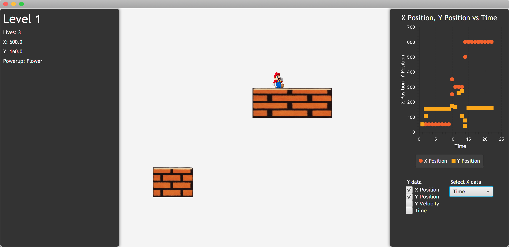
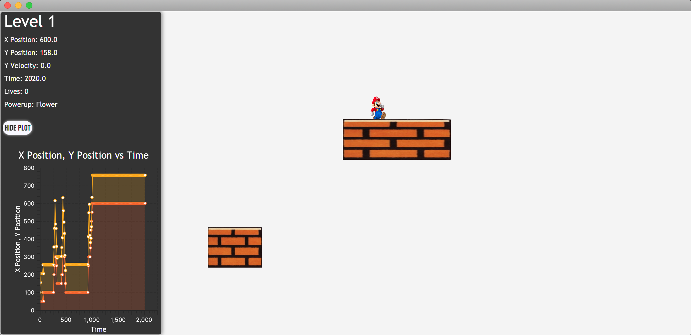

# Heads Up Display
### Overview
This utility has the ability to display current data of any kind for any game (or anything for that matter). 
It always displays the names of each data being 

The goal of this extension was to allow any developer to plot their data or display it in a HUD no matter the structure of their project, whether the developers use JavaFX bindings or not. 
We achieve this extreme flexibility with both the DataTracker class, which can store any Object.

This package contains relevant Java classes, screenshots and a video clip of the utility in action, and a css file that others can mess around with to fit the feel of their game player.

### Plotting
The crux of this utility is the Plotter class, which combines multiple selectors and a plot into one mini GUI. 
Through this GUI anyone, can change the current x axis data type and add or remove any amount of data types for the y axis 
(e.g. you can display both x and y position in the y axis vs time in the x axis). 

Since we only desire to plot numerical data against other numerical data (typically time), we defined Plotters and all its component classes to take in only NumericalDataTrackers. 
These are the exact same as DataTrackers, except with the guarantee of containing numerical data.

The PlotBuilder constructs plots based on a given set of DataTrackers and a given chart type. 
Each DataTracker contains a name of the data and a list of all values for the current session.

The Plotter tells the PlotBuilder what to data to plot and what chart type to use based on labeled VBoxes that are either ComboBoxes or CheckBoxes.

Someone must update the Plotter whenever new data is stored in the DataTrackers. This update is done by the HUDView.

### HUD
The HUD is a relatively simple scroll pane that consists of a title, modifiable at any time, and an unlimited number of displayed data labels. 
A developer need only specify the DataTrackers it's updating in a game loop, and the HUD will display the current data on a call to update. 

The HUD was originally designed to solely display text, but we decided to give designers the opportunity to include a Plotter within its ScrollPane.
It also includes a button to toggle the Plotter display. If you include the Plotter again after removing it, 
all your preferences for x and y axes and chart type remain the same. 

### Visuals
A Plotter displayed by itself.

The current HUDView that contains a toggleable Plotter.

We've also included a video of the HUDView in action using a basic mario game demo.

### Future Considerations
We believe the DataTracker class could become a useful tool for game analytics. For example, one could discover that a 
certain location in a level is too hard for users if players tend to die at a particular location. 

We would also like to make DataTrackers have the ability to save data to file eventually.