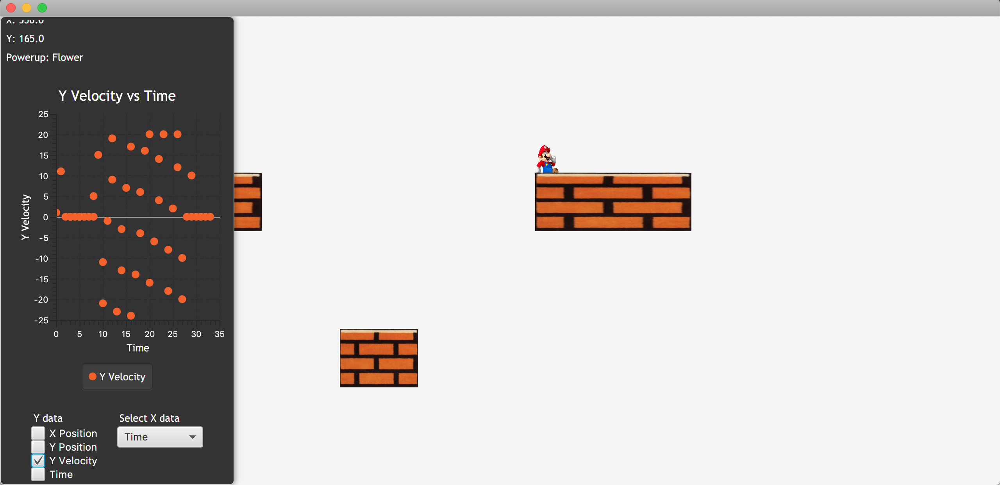

# JavaFX Plotter and Heads Up Display
### Overview
This utility has two purposes: 
1. To provide a system to store and plot numerical data for any game via the DataTracker and Plotter classes
2. To provide a HUD for displaying both categorical and numerical data for any game. The HUD has the ability to contain plots as well.

The goal of this extension was to allow any developer to plot their data or display it in a HUD no matter the structure of their project, whether the developers use JavaFX bindings or not. 
We achieve this extreme flexibility with both the DataTracker class, which can store any numerical value, and the HUD's ability to take in any Object to display.

This package contains relevant Java classes, screenshots and video clips of the utility in action, and a css file that others can mess around with to fit the feel of their game player.

### Plotting
The crux of this utility is the Plotter class, which combines multiple selectors and a plot into one mini GUI. 
Through this GUI anyone, can change the current x axis data type and add or remove any amount of data types for the y axis 
(e.g. you can display both x and y position in the y axis vs time in the x axis). 

The PlotBuilder constructs plots based on a given set of DataTrackers. Each DataTracker contains a name of the data and a list of all values for the current session.

The currently selected DataTracker(s) are managed by the XAxis and YAxis Selector classes, which extend the simple, abstract LabeledVBox class.

The developer must update the Plotter whenever they store new data in the DataTrackers.

### HUD
The HUD is a relatively simple scroll pane that consists of a title, modifiable at any time, and an unlimited number of displayed data. 
A developer must specify names for the data at construction, and then they must update the HUD with an array of Objects whose string representations will be displayed next to their corresponding labels.

The HUD was designed to be a singular entity, but we decided to give designers the opportunity to include a Plotter within its ScrollPane.

### Visuals
A Plotter displayed by itself.

A HUD that contains a Plotter.

### Future Considerations
We believe the DataTracker class could become a useful tool for game analytics. For example, one could discover that a 
certain location in a level is too hard for users if players tend to die at a particular location. 

We're also considering creating a HUD which automatically displays labels and current values for each DataTracker available to the Plotter, 
but currently, the HUD and Plotter are entirely encapsulated from each other i.e. if you choose to have a Plotter in your HUD, 
you have to tell the HUD to include x position in the HUD and separately include a DataTracker for x position in the Plotter. 
We chose to implement the HUD in this way for now because we believe a designer may not want to display every data type they're tracking.